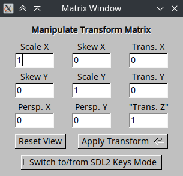
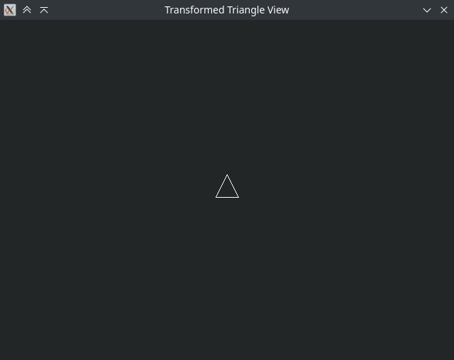

# Matrix Transform Toy/Visualizer

This is a mixed FLTK/SDL program that lets one play with matrix transforms and
see how such mathematical operations affect graphics.

## Matrix Edit Window (FLTK 1.3)
<p style="text-align: center">
    
</p>

This window allows for direct editing of the transform matrix's terms. After
changing values as you see fit, either click "Apply Transform" or press enter
to see the resulting transform. Clicking "Reset View" will reset the transform
matrix to the 3×3 identity, thereby also resetting the transformed triangle
view. Clicking "Switch to/from SDL2 Keys Mode" toggles between numerical input
within this window and transform control in the transform window.

## Transformed Triangle View (SDL2)
<p style="text-align: center">
    
</p>

This window uses a lines-only triangle to display the transforms either created
in the manipulation window or via the controls in Keys Mode. The controls for
Keys Mode are listed in the two tables below.

---

|    Key     | Effected when pressed without `SHIFT`              |
|:----------:|:---------------------------------------------------|
|  `ESCAPE`  | Exit the program                                   |
|    `TAB`   | Reset the transformation matix                     |
|    `UP`    | Translate triangle upward                          |
|   `DOWN`   | Translate triangle downward                        |
|   `LEFT`   | Translate triangle to the left                     |
|  `RIGHT`   | Translate triangle to the right                    |
|    `8`     | Increase scale in the X axis                       |
|    `7`     | Decrease scale in the X axis                       |
|    `5`     | Increase skew in the X axis                        |
|    `4`     | Decrease skew in the X axis                        |
|    `1`     | Rotate the triangle to the left by one degree      |
|    `2`     | Rotate the triangle to the right by one degree     |
| `KP_9`/`0` | Increase distance along the Z axis                 |
| `KP_6`/`9` | Decrease distance along the Z axis                 |
| `KP_*`/`=` | Increase perspective distortion in the X direction |
| `KP_/`/`-` | Decrease perspective distortion in the X direction |

---

|    Key     | Effected when `SHIFT` is being pressed             |
|:----------:|:---------------------------------------------------|
|    `8`     | Increase scale in the Y axis                       |
|    `7`     | Decrease scale in the Y axis                       |
|    `5`     | Increase skew in the Y axis                        |
|    `4`     | Decrease skew in the Y axis                        |
|    `1`     | Rotate the triangle to the left by ten degrees     |
|    `2`     | Rotate the triangle to the right by ten degrees    |
| `KP_*`/`=` | Increase perspective distortion in the Y direction |
| `KP_/`/`-` | Decrease perspective distortion in the Y direction |

---

## Compiling
You will need the following extra packages (along with whatever they depend on)
in WSL to build this. You can also install the Windows versions of the libraries
and try to build with MSYS2, though I have not tested this myself. These should
be installed through your package manager so that dependencies are handled for
you.

**NOTE:** the `+` markers indicated compatibility with later versions *in
the same family*. For FLTK this means using the older 1.3 line (latest version
is 1.3.11) instead of the more modern 1.4 release or 1.5 development lines. 
Similarly for SDL, this means that any version of SDL2 after 2.30 is supported
(the latest at time of writing is SDL 2.32.8).

- Fast Lightweight ToolKit, version 1.3.8+
- Simple DirectMedia Layer, version 2.30+

The following command will let you install all the necessary libraries and
development packages at once, provided your WSL instance is Ubuntu:
```sh
sudo apt install libfltk1.3t64 \
                 libfltk1.3-dev \
                 fluid \
                 libfltk-cairo1.3t64 \
                 libfltk-forms1.3t64 \
                 libfltk-gl1.3t64 \
                 libfltk-images1.3t64 \
                 libsdl2-2.0-0 \
                 libsdl2-dev \
                 libsdl2-image-2.0-0 \
                 libsdl2-image-dev \
                 libsdl2-mixer-2.0-0 \
                 libsdl2-net-2.0-0 \
                 libsdl2-ttf-2.0-0 \
                 libsdl2-ttf-dev
```

[CMake](https://cmake.org/download/) is required to build this software. If you
wish to use the supplied `build2` script, you will also need Bash.
